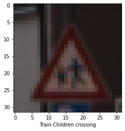
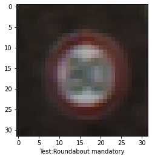
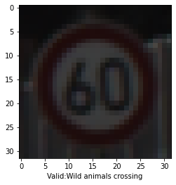
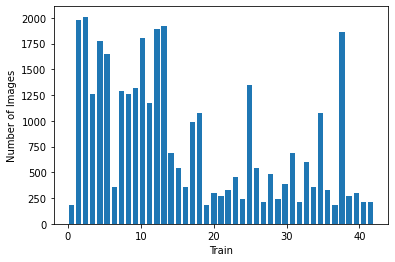
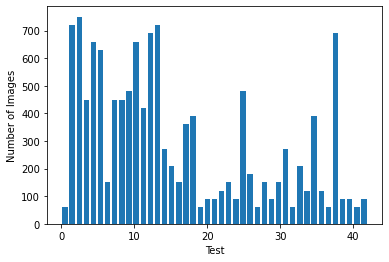
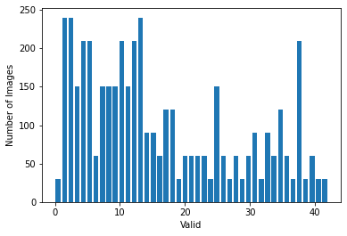

# Traffic Sign Recognition from Images
### Project Group 2
#### Nujhat Tasneem, Mohammad Adnaan, Daniel P Neelappa, Md. Shariful Islam

#### [Video Link](https://www.youtube.com/watch?v=kOIKduAOD5k)

## 1. Introduction

Traffic sign recognition (TSR) system is an indispensable part of autonomous self-driving car technologyand advanced driver assistance system (ADAS). There are many variabilities, such as collected image quality, lightening conditions, viewpoints, and motion blur, which have a high impact on the robustness of TSR tools (Few-shot traffic sign recognition with clustering inductive bias and random neural network).  


## 2. Data Description

## 3. Data Processing

## 4.Supervised Learning

For our project, we used tensorflow to implement deep learning models to perform image classification in Google Colab. Convolutional Neural Networks (CNN's) are a popular method to perform image classification and can achieve high accuracy for supervised learning. We implemented both a vanilla neural network, single layer CNN, and double layer CNN for this project. Lastly, we wanted to see how susceptible our model was for changes in the images. For this reason, we added noise to our testing set to examine the models susscesability to changes in the image quality.
### 4.1 Data Processing

The images we use for image classification have already been reduced to 32 by 32 pixels with the training set preconfigured to 34799 examples and 12630 photos dedicated to the testing segment. A small amount of 4410 images are used as validation for each epoch of training that we perform. The entire datset has 43 unqiue classes of image labels. Here are a few of the representations of images from the dataset in their 32px by 32px representations:

<p align="center">
   
</p>

<p align="center">Fig. 1 Image Example </p>

When reviewing other work and in our class lectures, we saw the use of histograms to visualize our data. Below are three histograms that show the distribution of the given training, validation, and test datasets.

As shown in the figures 24, the dataset provided for us have a relatively similar distribution across training, testing, and validation. Our models will experience a similar range of images during training and validation.

<p align="center">
   
</p>

<p align="center">Fig. 1 Image Example </p>
### 4.2 Results

## 5. Unsupervised Learning
### 5.1 Methods 
### 5.2 Results


## 6. Conclusion

## 7. References

You can use the [editor on GitHub](https://github.com/sharifulsazib04/CS7641ML.github.io/edit/master/README.md) to maintain and preview the content for your website in Markdown files.

Whenever you commit to this repository, GitHub Pages will run [Jekyll](https://jekyllrb.com/) to rebuild the pages in your site, from the content in your Markdown files.

### Markdown

Markdown is a lightweight and easy-to-use syntax for styling your writing. It includes conventions for

```markdown
Syntax highlighted code block

# Header 1
## Header 2
### Header 3

- Bulleted
- List

1. Numbered
2. List

**Bold** and _Italic_ and `Code` text

[Link](url) and 
```

For more details see [GitHub Flavored Markdown](https://guides.github.com/features/mastering-markdown/).

### Jekyll Themes

Your Pages site will use the layout and styles from the Jekyll theme you have selected in your [repository settings](https://github.com/sharifulsazib04/CS7641ML.github.io/settings). The name of this theme is saved in the Jekyll `_config.yml` configuration file.

### Support or Contact

Having trouble with Pages? Check out our [documentation](https://help.github.com/categories/github-pages-basics/) or [contact support](https://github.com/contact) and we’ll help you sort it out.
