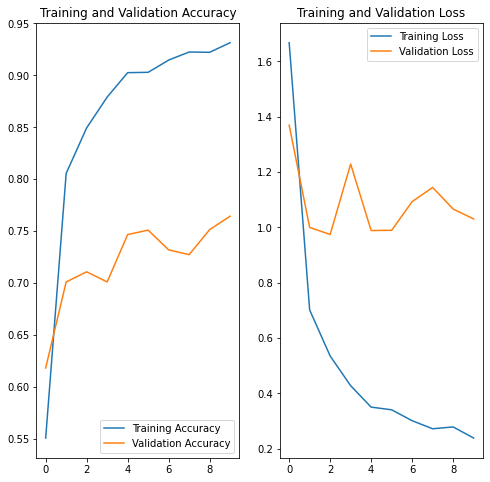
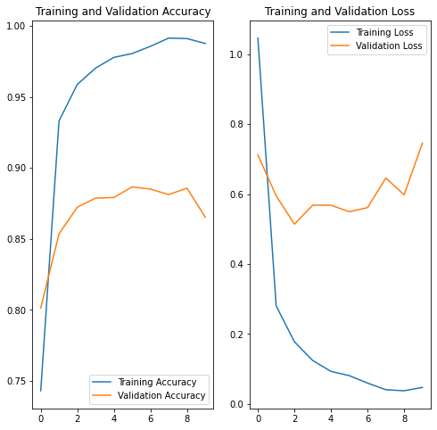
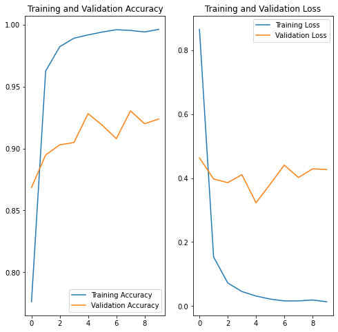
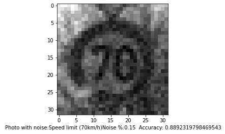
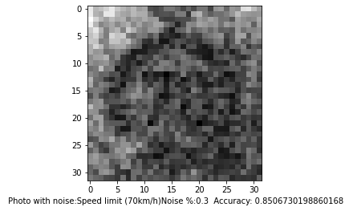
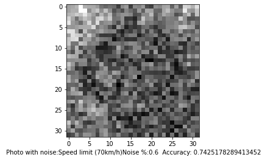
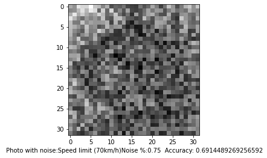

# Traffic Sign Recognition from Images
### Project Group 2
#### Nujhat Tasneem, Mohammad Adnaan, Daniel P Neelappa, Md. Shariful Islam

#### [Video Link](https://www.youtube.com/watch?v=kOIKduAOD5k)

## 1. Introduction

Traffic sign recognition (TSR) system is an indispensable part of autonomous self-driving car technologyand advanced driver assistance system (ADAS). There are many variabilities, such as collected image quality, lightening conditions, viewpoints, and motion blur, which have a high impact on the robustness of TSR tools (Few-shot traffic sign recognition with clustering inductive bias and random neural network).  


## 2. Data Description

## 3. Data Processing

## 4.Supervised Learning

For our project, we used tensorflow to implement deep learning models to perform image classification in Google Colab. Convolutional Neural Networks (CNN's) are a popular method to perform image classification and can achieve high accuracy for supervised learning. We implemented both a vanilla neural network, single layer CNN, and double layer CNN for this project. Lastly, we wanted to see how susceptible our model was for changes in the images. For this reason, we added noise to our testing set to examine the models susscesability to changes in the image quality.
### 4.1 Data Processing

The images we use for image classification have already been reduced to 32 by 32 pixels with the training set preconfigured to 34799 examples and 12630 photos dedicated to the testing segment. A small amount of 4410 images are used as validation for each epoch of training that we perform. The entire datset has 43 unqiue classes of image labels. Here are a few of the representations of images from the dataset in their 32px by 32px representations:

<p align="center">
   
</p>

<p align="center">Fig. 1 Image Example </p>

When reviewing other work and in our class lectures, we saw the use of histograms to visualize our data. Below are three histograms that show the distribution of the given training, validation, and test datasets.

As shown in the figures 24, the dataset provided for us have a relatively similar distribution across training, testing, and validation. Our models will experience a similar range of images during training and validation.

<p align="center">
   
</p>

<p align="center">Fig. 2 Distribution of training, test and validation datasets </p>

### 4.2 Vanilla Fully Connected Neural Network

Below is an implementation of a fully connected neural network. The image which is 32px by 32px is flattened into an array of 1024 values. The network architecture consists of two hidden layers with 512 and 256 nodes each with a relu activation. Since there are 43 class labels and we begin with 1024 values in an image, we need to reduce the dimensionality from 1024 to 43. We decided to halve the number of layer nodes as an arbitrary way to reduce dimensionality. If we had additional time, we could expand the hidden layers of the network to a large number and slowly reduce the dimensionality as long as the accuracy isn't significantly affected. With our current implementation, we were able to achieve 93% in-sample accuracy and a 78% accuracy for out of sample testing.

<p align="center">
 
</p>

<p align="center">Fig. 3 Accuracy and loss plots </p>

We also experimented with a single fully connected hidden layer with 512 nodes and a relu activation. In-sample accuracy was 95%, but out of sample accuracy was lower at 75%. With the small accuracy gain by doubling the hidden layers of the model, we decided to move on to using convolutional neural networks.

<p align="center">
 
</p>

<p align="center">Fig. 4 Accuracy and loss plots of hidden layer</p>

### 4.3 Convolutional Neural Networks (CNN's)

CNN's differ from fully connected neural networks because we do not flatten the image into an array like in a fully connected neural network. CNN's have kernels which are filters that slide over the image capturing features for distinguishing labels. The last layer of a CNN network is a fully connected layer for selecting a given label.

Below are two CNN models. The first uses a double layer CNN network with relu activations. The first CNN has a stride of 1 and a kernel size of 6 by 6. We used a stride of one as we want to have a maximum of overlap with our small images as we slide the kernel. The filter size was slowly incremented from 2 to 7 by 7. A filter size of 6 by 6 was experimentally shown to provide the best accuracy given our other hyperparameters. The 2nd layer was set to a kernel size of 5 by 5. The CNN layer is then flattened with one hidden layer of 200 nodes before the 43 node layer for classification with a softmax activation. We always use a softmax activation as this limits the output from 0 to 1 which can be used to represent probabilities.

Both architectures performed very well at generalizing the dataset. The single CNN model was able to obtain a 87% accuracy during training and a 86% accuracy for the test set. The double layer CNN was able to achieve 92% in training and 90% in the testing set. Both of these were significantly better than the fully connected neural network and were able to achieve high accuracy with a limited number of layers.

<p align="center">
 
</p>

<p align="center">Fig. 5 Accuracy and loss plots of single and double layer CNN </p>

### 4.4 Noise Addition

Below shows a series of photos with a percentage of noise added to each. 100% noise is an value added to the normalized grayscale image from 0 to 1. A noise percentage is mupltiplied to the random value to scale the max value down from the original 1. We used our highest accuracy model which was the double layer CNN architecture.

The photos below show the accuracy and the visual depiction of several levels of noise percentage. With 15% noise, we can see a clear speed limit sign and the model has a 88% accuracy. At 75% noise, the model can obtain an almost 70% accuracy while the sign is hardly visible to the human eye.

<p align="center">
   
</p>

<p align="center">Fig. 6 Photowith noise </p>
## 5. Unsupervised Learning
### 5.1 Methods 
### 5.2 Results


## 6. Conclusion

## 7. References

You can use the [editor on GitHub](https://github.com/sharifulsazib04/CS7641ML.github.io/edit/master/README.md) to maintain and preview the content for your website in Markdown files.

Whenever you commit to this repository, GitHub Pages will run [Jekyll](https://jekyllrb.com/) to rebuild the pages in your site, from the content in your Markdown files.

### Markdown

Markdown is a lightweight and easy-to-use syntax for styling your writing. It includes conventions for

```markdown
Syntax highlighted code block

# Header 1
## Header 2
### Header 3

- Bulleted
- List

1. Numbered
2. List

**Bold** and _Italic_ and `Code` text

[Link](url) and 
```

For more details see [GitHub Flavored Markdown](https://guides.github.com/features/mastering-markdown/).

### Jekyll Themes

Your Pages site will use the layout and styles from the Jekyll theme you have selected in your [repository settings](https://github.com/sharifulsazib04/CS7641ML.github.io/settings). The name of this theme is saved in the Jekyll `_config.yml` configuration file.

### Support or Contact

Having trouble with Pages? Check out our [documentation](https://help.github.com/categories/github-pages-basics/) or [contact support](https://github.com/contact) and we’ll help you sort it out.
