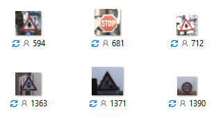
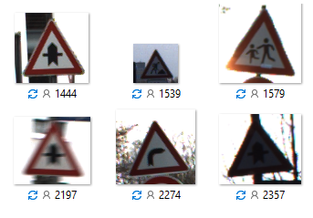

# Traffic Sign Recognition from Images
### Project Group 2
#### Nujhat Tasneem, Mohammad Adnaan, Daniel P Neelappa, Md. Shariful Islam

#### [Video Link](https://www.youtube.com/watch?v=kOIKduAOD5k)

## 1. Introduction

Traffic sign recognition system is an indispensable part of autonomous self-driving car technologyand advanced driver assistance system(ADAS). Different categories of algorithms like histogram oforiented gradients (HOG), scale-invariant feature transform (SIFT), convolutional neural networks(CNN) have been used to enhance the performance of this detection system.  Besides the role of algorithm  used  in  detection,  several  other  practical  case  scenarios  like  weather  condition,  colorfading, disorientation of signs make the task a challenging one.  In our project we have used a standard dataset provided by GTSRB (German traffic sign recognition benchmark)[1] which contains more than 50000 images organized in 43 classes for training purpose and few thousands ofrandomized images to test the performance of detection algorithm.  We have used convoultional neural network (CNN)[2] for supervised learning and for unsupervised learning Kmeans based clustering, gaussian mixture model (GMM) with principal component analysis (PCA) has been used.

## 2. Data Description
The images we use for image classification have already been reduced to 32 by 32 pixels with the training set preconfigured to 34799 examples and 12630 photos dedicated to the testing segment. A small amount of 4410 images are used as validation for each epoch of training that we perform. The entire datset has 43 unqiue classes of image labels. Here are a few of the representations of images from the dataset in their 32px by 32px representations:

   

Fig. 1 Image Example 

When reviewing other work and in our class lectures, we saw the use of histograms to visualize our data. Below are three histograms that show the distribution of the given training, validation, and test datasets.

As shown in the figures 24, the dataset provided for us have a relatively similar distribution across training, testing, and validation. Our models will experience a similar range of images during training and validation.

   

Fig. 2 Distribution of training, test and validation datasets 

## 3.Supervised Learning

For our project, we used tensorflow to implement deep learning models to perform image classification in Google Colab. Convolutional Neural Networks (CNN's) are a popular method to perform image classification and can achieve high accuracy for supervised learning. We implemented both a vanilla neural network, single layer CNN, and double layer CNN for this project. Lastly, we wanted to see how susceptible our model was for changes in the images. For this reason, we added noise to our testing set to examine the models susscesability to changes in the image quality.

### 3.1 Vanilla Fully Connected Neural Network

Below is an implementation of a fully connected neural network. The image which is 32px by 32px is flattened into an array of 1024 values. The network architecture consists of two hidden layers with 512 and 256 nodes each with a relu activation. Since there are 43 class labels and we begin with 1024 values in an image, we need to reduce the dimensionality from 1024 to 43. We decided to halve the number of layer nodes as an arbitrary way to reduce dimensionality. If we had additional time, we could expand the hidden layers of the network to a large number and slowly reduce the dimensionality as long as the accuracy isn't significantly affected. With our current implementation, we were able to achieve 93% in-sample accuracy and a 78% accuracy for out of sample testing.

 

Fig. 3 Accuracy and loss plots 

We also experimented with a single fully connected hidden layer with 512 nodes and a relu activation. In-sample accuracy was 95%, but out of sample accuracy was lower at 75%. With the small accuracy gain by doubling the hidden layers of the model, we decided to move on to using convolutional neural networks.

 

Fig. 4 Accuracy and loss plots of hidden layer

### 3.2 Convolutional Neural Networks (CNN's)

CNN's differ from fully connected neural networks because we do not flatten the image into an array like in a fully connected neural network. CNN's have kernels which are filters that slide over the image capturing features for distinguishing labels. The last layer of a CNN network is a fully connected layer for selecting a given label.

Below are two CNN models. The first uses a double layer CNN network with relu activations. The first CNN has a stride of 1 and a kernel size of 6 by 6. We used a stride of one as we want to have a maximum of overlap with our small images as we slide the kernel. The filter size was slowly incremented from 2 to 7 by 7. A filter size of 6 by 6 was experimentally shown to provide the best accuracy given our other hyperparameters. The 2nd layer was set to a kernel size of 5 by 5. The CNN layer is then flattened with one hidden layer of 200 nodes before the 43 node layer for classification with a softmax activation. We always use a softmax activation as this limits the output from 0 to 1 which can be used to represent probabilities.

Both architectures performed very well at generalizing the dataset. The single CNN model was able to obtain a 87% accuracy during training and a 86% accuracy for the test set. The double layer CNN was able to achieve 92% in training and 90% in the testing set. Both of these were significantly better than the fully connected neural network and were able to achieve high accuracy with a limited number of layers.

 

Fig. 5 Accuracy and loss plots of single and double layer CNN 

### 3.3 Noise Addition

Below shows a series of photos with a percentage of noise added to each. 100% noise is an value added to the normalized grayscale image from 0 to 1. A noise percentage is mupltiplied to the random value to scale the max value down from the original 1. We used our highest accuracy model which was the double layer CNN architecture.

The photos below show the accuracy and the visual depiction of several levels of noise percentage. With 15% noise, we can see a clear speed limit sign and the model has a 88% accuracy. At 75% noise, the model can obtain an almost 70% accuracy while the sign is hardly visible to the human eye.

   

Fig. 6 Photo with noise 

### 3.4 Graphical User Interface (GUI)
Finally, we have made a GUI to facilitate image classification testing. In this GUI we can choose a particular image from test set and in the backend the trained supervised model will run and show the class of image that we have selected.

  

Fig. 7 GUI for testing 

## 4. Unsupervised Learning

We used only the “Test" images (total 12,620 images) for the unsupervised part of the project since those do not have any label. We used unsupervised learning models to cluster similar images i.e. same traffic signs. Unsupervised approach to this problem is expected to yield very low accuracy [3]. Hence, this part of the project will mainly be used as a source of providing us more insight about the dataset and the results could be used in supervised learning and classification in the future.

### 4.1 Methods and Analysis

We applied two unsupervised learning models to group similar images. The first one was KMeans clustering technique which assumes circular clustering of data. The second one is known as Gaussian Mixture Models (GMM) that assumes the entire dataset is a linear combination of components modeled as normal distribution. Principal component analysis (PCA) is also utilized for both algorithms to reduce the number of features of the images. Finally, the clustering models are evaluated using commonly known scores or metrics. Python scikit-learn package was used mostly to implement unsupervised learning and scikit-image package was used for image preprocessing.

#### 4.1.1 Image Preprocessing

Images were preprocessed before passing through the models. The images used here have very low resolution, often dark, tilted, blurry and their sizes do not match as well. Each pixel of an image is cosidered as its feature. Images were first resized to 32 by 32 pixels, this way their sizes and feature space became equal. Afterwards, Contrast-limited adaptive histogram equalization (CLAHE) [4,5] was used to increase the contrast of the images. Finally, the images were cropped to make them more centered and to reduce the effect of the background. However, the cropping dimensions were constant for all images although not all images were captured from the same distance, Hence, images which were too zoomed out, were not cropped properly and sometimes ended up in a different cluster than it was meant to be in.

 

Fig. 8 Images after preprocessing 

The figure above shows how the images look after preprocessing. Please note that the darkness, tild and blur of the images were reduced.

#### 4.1.2 KMeans

KMeans was first applied to the set of test images. However, in order to do that, the optimal number of clusters need to be chosen which can be done by implementing elbow method as well as measuring the Silhouette Score. Silhouette score measures the average similarity of the objects within a cluster and their distance to the other objects in the other clusters [6]. The values stays in -1 to 1 range and higher values are better while values = 0 indicate overlapping between clusters.

Elbow method was implemented where KMeans algorithm was applied to the image-set varying the number of clusters, k. At the same time Silhouette score was being measured.

 

Fig. 9 Elbow method (varying number of clusters) 

Fig. 9 shows the elbow i.e. optimal number of cluster ranges between 25 to 50 and Silhouette score also peaks at around k ≈ 40. Hence, the optimal number of clusters was chosen at around 43 (which is also the actual number of classes). However, please notice that the Silhouette scores are very low, around ~0.06, which indicates that many clusters have overlap.

   

Fig. 10 Evaluation of KMeans model varying number of PCA components 

We then decided to apply PCA to reduce the number of the features and also to see if the silhouette score increases. KMeans algorithm was then run again varying the number of PCA components. One more evaluation technique named Davies–Bouldin (DB) index was used which is based on a ratio between “within-cluster” and “between-cluster” distances [6]. The lower the values of DB index, the better the clustering. It can be seen from the fig 10 that as the number of components increases, the clustering becomes worse (distortion increases, Silhouette score decreases and DB index increases). Hence a very low number of components, 50 was used. Since the number of features were reduced from 1728 to 50. Hence the efficiency of the model improved a lot since the time to run the code decreased by a large amount.

   

Fig. 11 Evaluation of KMeans model varying number of PCA components 

The elbow method was once again applied to the PCA implemented image-set. The plot in fig 11 shows that the optimal number of clusters lies near 40-50 range. On the other hand, the Silhouette score and DB index both keep getting better as # of clusters increases. We have tried applied KMeans in the dataset with both 43 and 90 clusters. It is seen that as as cluster number increases, unnecessary clustering also increases. This will be elaborated more in the results section.

We ended up choosing cluster number 43 again depending on the distortion score (1st plot of fig 11). Hence the final parameters of this model are: # of clusters = 43 and # of PCA components = 50. Notice that, Although, after applying PCA, the Silhouette score increases from 0.06 to 0.1, it is still very low. A major reason for that is KMeans mostly try to do circular clustering and it assumes similar number of elements in each cluster. From Fig. 2 in section 2 we can see that number of images in each class widely varies, which is a reason for poor clustering due to KMeans, even after applying PCA.

#### 4.1.3 GMM

The second unsupervised algorithm we applied was the Gaussian Mixture Model (GMM). Although it is a soft clustering technique, we ended up assigning each image to the component it had higher probability of belonging. We applied PCA with 50 components on the dataset alongside GMM. To determine the optimal number of GMM components and the covariance type, we calculated Bayesian Information Criterion (BIC) varying the number of components and for four types of covariances [7]. BIC is used to check the reduction in the log-likelihood of models. The lower the BIC value, the better the GMM model is. At the same time Silhouette score and DB index were calculated.

  
  
 

Fig. 12 Evaluation of GMM model by varying # of GMM componets 

From Fig 12, we can see that, if GMM component number increases, both Silhouette and DB scores seem to get better (higher for Silhouette score and lower for DB index). In case of DB index, it seems ‘Spherical’ type covariance is lowest (best) until 55 clusters. However, BIC scores were always the highest (worst) for ‘Spherical’ type covariance (Fig 12). On the other hand, BIC score is the lowest (best) for 'full' type covariance until 55 clusters. Silhouette score is also the highest (best) for 'full' type covariance for # of components = 35 and beyond. Therefore, a cluster number in the range of 35 to 55 should give better result. We can also see from Fig 12, around 35 clusters, the DB index for both ‘Spherical’ and ‘full’ type covariances become similar and not that high.

Hence, the parameters set for optimal GMM model are: 'full' type covariance with 50 PCA components and component number 35. The Silhouette score in this setting is ~0.07. We also ended up applying the GMM model with 15 components on the dataset since the BIC score was so small but that did not give us a very good result which will be elaborated in the “Results” section.

   
 

Fig. 13 Evaluation of GMM model by varying # of PCA components 

To confirm that the PCA comp was good, at cluster number 35 and 'full' type covariance, the scores were evaluated again by changing the # of PCA components. Fig 13 shows that lower number of PCA components (50 used here) gives better scores. The method was run on the dataset for higher number of PCA components (500) as well, and from inspection, it did not improve the result. Hence for efficiency, lower number of PCA components (50) would be a wise choice.

### 4.2 Results

#### 4.2.1 KMean Results

The link to the KMeans applied result (43 clusters with PCA) is as follows:

#### [Kmean Results](https://gtvault-my.sharepoint.com/:f:/g/personal/ntasneem3_gatech_edu/EpqAuUOQdyNOkM4IkETvlDMBCvGiw4uuyabVzoy8oehb2A?e=ZIoOcs)

Some of the signs were clustered pretty well while others were not. Moat of the signs that are clustered successfully have only a few significant features (signs having only two colors), less details.

  
    
  

Fig. 14 Example of good clustering using KMeans 

  
    

Fig. 15 Example of moderate clustering using KMeans. In the 1st plot triangular signs are clustered together, 2nd plot shows “white circles with black slashes” are clustered together, 3rd plot shows all vehicles’ image are clustered together, 4th plot shows many blue and white signs are clustered together. 5th one shows numbers are clustered together 

  

Fig. 16 Example of bad clustering using KMeans 

Fig 15 shows even if some signs were not perfectly clustered, they had a similar pattern. The last plot if Fig 16 just shows bad clustering while the 1st one has a subtle pattern. Although the signs do not match in the first one, most of these signs are zoomed out and circular in shape and have been clustered together. This leads to the assumption that camera angle, position, zooming, brightness and color of image, background plays major part in clustering of this particular image-set even after preprocessing the images. The following figure (Fig 17) shows that the visually similar “Construction Sign” was successfully clustered while the darker or visually different “Construction sign” was placed in another cluster erroneously.

  

Fig. 17 ‘Construction Sign” Clustering 

Some signs like the ‘Yield’ sign, ‘Priority Road’ Sign were clustered successfully but instead of one, these were divided into 2-3 clusters. We applied the same model with 26 clusters instead of 43 and this unnecessary clustering problem was reduced. However, some of the signs were erroneously clustered at 26 clusters which were successfully clustered at 43 clusters. This can explain the contradictory result in Fig. 10

#### 4.2.2 GMM Results

The link to the GMM applied result (35 components with PCA) is as follows:

#### [GMM Results](https://gtvault-my.sharepoint.com/:f:/g/personal/ntasneem3_gatech_edu/EippTfkRbutMrobxAm4_o_8BT6LUhNJZ624bcqruazUAIQ?e=tFDRB7)

The result of GMM modeling is pretty similar to the KMeans model. The Silhouette score is also very small in this case.

### 4.3 Discussion

Scores of KMeans and GMM model applied on the “Test” images are not that good, The values are greater than 0 but very small indicating overlapping among clusters which is evident from the results. PCA seemed to improve their performance but not by much. However, PCA largely reduces the number of required features increasing the efficiency. For both cases, the Silhouette score and DB index both seem to get better as number of clusters increases, however this also leads to unnecessary clustering. This is evident in the contradictory trend of distortion and BIC score with # of classes for KMeans and GMM respectively. Camera angle and position, brightness of image, background – these seemed to have effect the clustering and many images are clustered according to these traits. However, many simple signs with less detail (‘Stop’, ‘Do not enter’, ‘Yield’, ‘Priority Road’, Blue and white signs etc) are clustered successfully although there overlaps with other clusters. Major reasons of the unsupervised clustering techniques not working are the low resolution of the images (since each pixel is considered a feature), unequal size of images (hence possible data loss while resizing all the images) and unequal distribution of images among the classes etc.

## 5. Conclusion

## 6. References

1. J. Stallkamp, M. Schlipsing, J. Salmen, and C. Igel. The German Traffic Sign Recognition Benchmark: A multi-class classification competition. In Proceedings of the IEEE International Joint Conference on Neural Networks, pages 1453–1460. 2011 

2. O'Shea, Keiron, and Ryan Nash. "An introduction to convolutional neural networks." arXiv preprint arXiv:1511.08458 (2015)

3. Supriyanto, Catur, Ardytha Luthfiarta, and Junta Zeniarja. "An unsupervised approach for traffic sign recognition based on bag-of-visual-words." 2016 8th International Conference on Information Technology and Electrical Engineering (ICITEE). IEEE, 2016

4. https://mc.ai/traffic-sign-recognition/

5. https://en.wikipedia.org/wiki/Adaptive_histogram_equalization#Contrast_Limited_AHE

6. https://gdcoder.com/silhouette-analysis-vs-elbow-method-vs-davies-bouldin-index-selecting-the-optimal-number-of-clusters-for-kmeans-clustering/

7. https://scikit-learn.org/stable/auto_examples/mixture/plot_gmm_selection.html?fbclid=IwAR1IKGRPcG4hqPokKCyE3SS_nWZdEYpO1DG6XyGA-XOYccMZJyxzFTHuHYE

